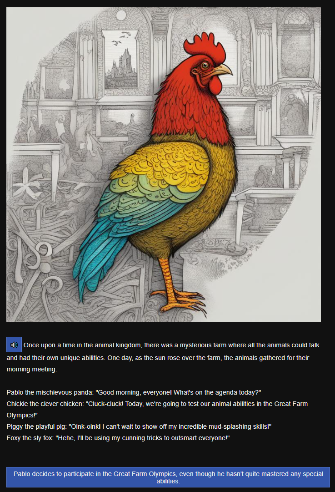



 

<!-- <h1>Projects</h1> -->

<!-- 
 -->

  

    <!-- 

      
    
 -->
    

      <h2>SnipDue: Never Miss Another Deadline</h2>
      

      Snip pictures of your class schedules, and SnipDue adds all your deadlines to your favorite calendar. It's that easy.
      My team of two won the "Best Use of GenAI Award" out of 221 participants at <a href="https://sb-hacks-xi.devpost.com/">SBHack XI</a>
      

      

        <a href="https://snipdue.tech/" target="_blank" style="flex: 1; display: inline-block; padding: 0.5rem; text-align: center; background-color: #333; color: white; text-decoration: none; border-radius: 4px; font-size: 0.9rem; white-space: nowrap;">
          <i class="fas fa-external-link-alt" style="margin-right: 0.5rem;"></i>Pitch
        </a>
        <a href="https://snipdue.tech/calendar" target="_blank" style="flex: 1; display: inline-block; padding: 0.5rem; text-align: center; background-color: #333; color: white; text-decoration: none; border-radius: 4px; font-size: 0.9rem; white-space: nowrap;">
          <i class="fas fa-external-link-alt" style="margin-right: 0.5rem;"></i>Try it
        </a>
        <a href="https://www.youtube.com/embed/SXRZ5oiWmYE?autoplay=1&fs=1" target="_blank" style="flex: 1; display: inline-block; padding: 0.5rem; text-align: center; background-color: #333; color: white; text-decoration: none; border-radius: 4px; font-size: 0.9rem; white-space: nowrap;">
          <i class="fab fa-youtube" style="margin-right: 0.5rem;"></i>See it
        </a>
        <a href="https://devpost.com/software/ssnip" target="_blank" style="flex: 1; display: inline-block; padding: 0.5rem; text-align: center; background-color: #333; color: white; text-decoration: none; border-radius: 4px; font-size: 0.9rem; white-space: nowrap;">
          <i class="fas fa-file-alt" style="margin-right: 0.5rem;"></i>DevPost
        </a>
        <a href="https://github.com/sklesner/ssnip" target="_blank" style="flex: 1; display: inline-block; padding: 0.5rem; text-align: center; background-color: #333; color: white; text-decoration: none; border-radius: 4px; font-size: 0.9rem; white-space: nowrap;">
          <i class="fas fa-file-alt" style="margin-right: 0.5rem;"></i>GitHub
        </a>
      

    

    

      
      <!--  -->
    

  

  
 

  

    <!-- 

      
    
 -->
    

      <h2>Understanding XAI Requirements: A Comparative Study of Repetitive and Unique Decision Contexts</h2>
      
Two Explainable AI (XAI) prototypes were designed and tested with four groups of subjects. My partner designed the "Commerce Moderator" and I designed the "Communication Monitor" shown here. 
      <!-- for detection and resolution of inconsistencies in communications, combining memory augmentation with fact-checking. -->
      

      <!-- 
      My user tests found that:
      <ul>
        <li></li> 
        <li></li> 
        <li></li> 
      </ul> -->
      

        <!-- <a href="https://xai.ackop.com/xai_169.pdf" target="_blank" style="flex: 1; display: inline-block; padding: 0.5rem; text-align: center; background-color: #333; color: white; text-decoration: none; border-radius: 4px; font-size: 0.9rem; white-space: nowrap;">
          <i class="fas fa-file-powerpoint" style="margin-right: 0.5rem;"></i>Slides
        </a> -->
        <!-- <a href="https://xai.ackop.com/moderator.html" target="_blank" style="flex: 1; display: inline-block; padding: 0.5rem; text-align: center; background-color: #333; color: white; text-decoration: none; border-radius: 4px; font-size: 0.9rem; white-space: nowrap;">
          <i class="fas fa-external-link-alt" style="margin-right: 0.5rem;"></i>Moderator Prototype
        </a> -->
        <a href="https://memoir.ackop.com/index7.html" target="_blank" style="flex: 1; display: inline-block; padding: 0.5rem; text-align: center; background-color: #333; color: white; text-decoration: none; border-radius: 4px; font-size: 0.9rem; white-space: nowrap;">
          <i class="fas fa-external-link-alt" style="margin-right: 0.5rem;"></i>Pitch
        </a>
        <a href="https://xai.ackop.com/monitor.html" target="_blank" style="flex: 1; display: inline-block; padding: 0.5rem; text-align: center; background-color: #333; color: white; text-decoration: none; border-radius: 4px; font-size: 0.9rem; white-space: nowrap;">
          <i class="fas fa-external-link-alt" style="margin-right: 0.5rem;"></i>Design
        </a>
        <a href="https://memoir.ackop.com/mapp/split_0014/index.html" target="_blank" style="flex: 1; display: inline-block; padding: 0.5rem; text-align: center; background-color: #333; color: white; text-decoration: none; border-radius: 4px; font-size: 0.9rem; white-space: nowrap;">
          <i class="fas fa-external-link-alt" style="margin-right: 0.5rem;"></i>WebApp
        </a>
        <a href="https://xai.ackop.com/xai_0021.pdf" target="_blank" style="flex: 1; display: inline-block; padding: 0.5rem; text-align: center; background-color: #333; color: white; text-decoration: none; border-radius: 4px; font-size: 0.9rem; white-space: nowrap;">
          <i class="fas fa-file-alt" style="margin-right: 0.5rem;"></i>Preprint
        </a>
      

    

    

      
      <!--  -->
    

  

  
 

  

    

      <h2>Embedding Augmentation of USDA’s Food Nutrient Imputation</h2>
      
Can <a href="#">OpenAI's embeddings</a> augment <a href="#">USDA's National Food Nutrient Database</a>? 
      Yes! 
      (1) Embeddings can cluster foods more precisely than existing food groups.
      (2) Embeddings and their clusters can predict the nutritional content of foods.
      (3) Imputation powered by embedding vectors can be better than traditional imputation.
      

      <!-- <ul>
        <li>Embedding vectors can cluster foods more precisely than existing food groups.</li>
        <li>Embedding vectors and their clusters can predict the nutritional content of foods.</li>
        <li>Predictions powered by embedding vectors can be better than traditional imputation.</li>
      </ul> -->
      <!-- 
These questions and others are investigated.
 -->
      <!-- 

        <a href="https://fnana3.ackop.com/fnana0043g.html" target="_blank" style="flex: 1; display: inline-block; padding: 0.5rem; text-align: center; background-color: #333; color: white; text-decoration: none; border-radius: 4px; font-size: 0.9rem; white-space: nowrap;">
          <i class="fas fa-external-link-alt" style="margin-right: 0.5rem;"></i>Ipynb
        </a>
      
 -->
      

        <a href="https://fnana3.ackop.com/fnana0043g.html" target="_blank" style="flex: 1; display: inline-block; padding: 0.5rem; text-align: center; background-color: #333; color: white; text-decoration: none; border-radius: 4px; font-size: 0.9rem; white-space: nowrap;">
          <i class="fas fa-external-link-alt" style="margin-right: 0.5rem;"></i>Notebook
        </a>
      

      

        <a href="https://fnana3.ackop.com/fnana0043g.html" target="_blank" style="flex: 1; display: inline-block; padding: 0.5rem; text-align: center; background-color: #333; color: white; text-decoration: none; border-radius: 4px; font-size: 0.9rem; white-space: nowrap;">
          <i class="fas fa-external-link-alt" style="margin-right: 0.5rem;"></i>Preprint
        </a>
      

    

    

      
    

  

  
 

  

    

      <h2>AI Personalized Interactive Fiction</h2>
      
Can generative AI be used to create personalized interactive stories for young children?
        Yes! 
        (1) LLMs can be made to follow story plans and can even create stories with "choose your own adventure" branching naratives.
        (2) With AI models like Flux/Imagen/DALL·E/StableDiffusionXL visual storytelling by AI is now starting to be possible.
        (3) Immersive story narration is possible using voices, sounds and music with AI models like Bark and MusicGen.
      

      <!-- <ul>
        <li>Large Language Models for dynamic narrative generation</li>
        <li>Text-to-Image (StableDiffusion XL) for visual storytelling</li>
        <li>Text-to-Speech (Bark) and Music Generation (MusicGen) for immersive audio</li>
      </ul> -->
      

        <a href="https://youtu.be/TaVGem3nFrk" target="_blank" style="flex: 1; display: inline-block; padding: 0.5rem; text-align: center; background-color: #333; color: white; text-decoration: none; border-radius: 4px; font-size: 0.9rem; white-space: nowrap;">
          <i class="fab fa-youtube" style="margin-right: 0.5rem;"></i>See it
        </a>
        <a href="https://www.ufafu.com/" target="_blank" style="flex: 1; display: inline-block; padding: 0.5rem; text-align: center; background-color: #333; color: white; text-decoration: none; border-radius: 4px; font-size: 0.9rem; white-space: nowrap;">
          <i class="fas fa-external-link-alt" style="margin-right: 0.5rem;"></i>Try it
        </a>
        <a href="https://github.com/jlesner/aipif" target="_blank" style="flex: 1; display: inline-block; padding: 0.5rem; text-align: center; background-color: #333; color: white; text-decoration: none; border-radius: 4px; font-size: 0.9rem; white-space: nowrap;">
          <i class="fab fa-github" style="margin-right: 0.5rem;"></i>GitHub
        </a>
        <a href="https://www.ufafu.com/" target="_blank" style="flex: 1; display: inline-block; padding: 0.5rem; text-align: center; background-color: #333; color: white; text-decoration: none; border-radius: 4px; font-size: 0.9rem; white-space: nowrap;">
          <i class="fas fa-external-link-alt" style="margin-right: 0.5rem;"></i>Publication
        </a>
        <a href="https://www.ufafu.com/" target="_blank" style="flex: 1; display: inline-block; padding: 0.5rem; text-align: center; background-color: #333; color: white; text-decoration: none; border-radius: 4px; font-size: 0.9rem; white-space: nowrap;">
          <i class="fas fa-external-link-alt" style="margin-right: 0.5rem;"></i>Conference
        </a>
      

    

    

      
    

  

  
 

  

    

      <h2>State Machine Visualizer (SMV)</h2>
      
Developed a tool to help students better understand complex computational systems by:

      <ul>
        <li>Automatically generating visual representations of state machines</li>
        <li>Creating an intuitive bridge between code and visual understanding</li>
        <li>Supporting computer science education through improved system visualization</li>
      </ul>
      

        <a href="https://github.com/jlesner/smv2" target="_blank" style="flex: 1; display: inline-block; padding: 0.5rem; text-align: center; background-color: #333; color: white; text-decoration: none; border-radius: 4px; font-size: 0.9rem; white-space: nowrap;">
          <i class="fab fa-github" style="margin-right: 0.5rem;"></i>GitHub
        </a>
        <a href="https://www.youtube.com/watch?v=IHp0X0J5Di8?autoplay=1&fs=1" target="_blank" style="flex: 1; display: inline-block; padding: 0.5rem; text-align: center; background-color: #333; color: white; text-decoration: none; border-radius: 4px; font-size: 0.9rem; white-space: nowrap;">
          <i class="fab fa-youtube" style="margin-right: 0.5rem;"></i>See it
        </a>
      

    

    

      
    

  

  
<!-- 
 -->

<!-- Add Font Awesome for icons -->
<link rel="stylesheet" href="https://cdnjs.cloudflare.com/ajax/libs/font-awesome/5.15.4/css/all.min.css">
