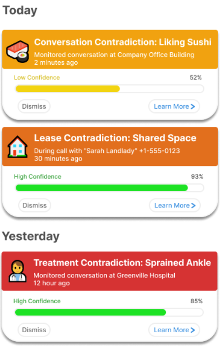
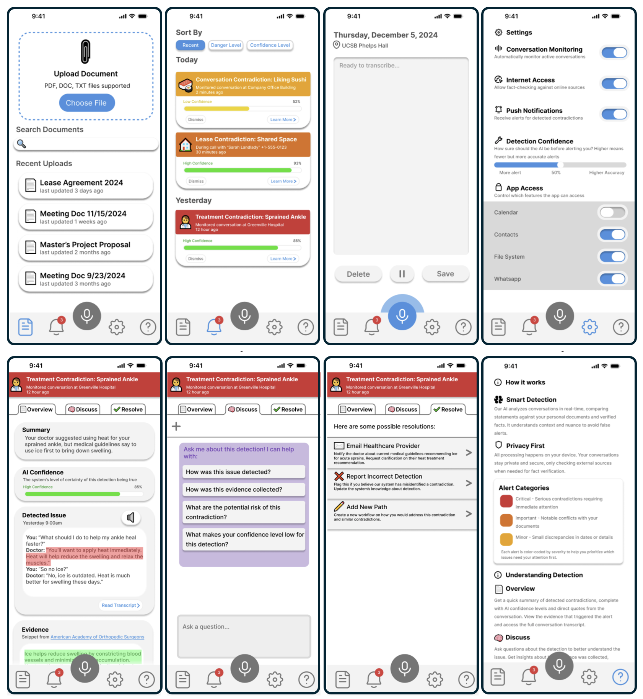
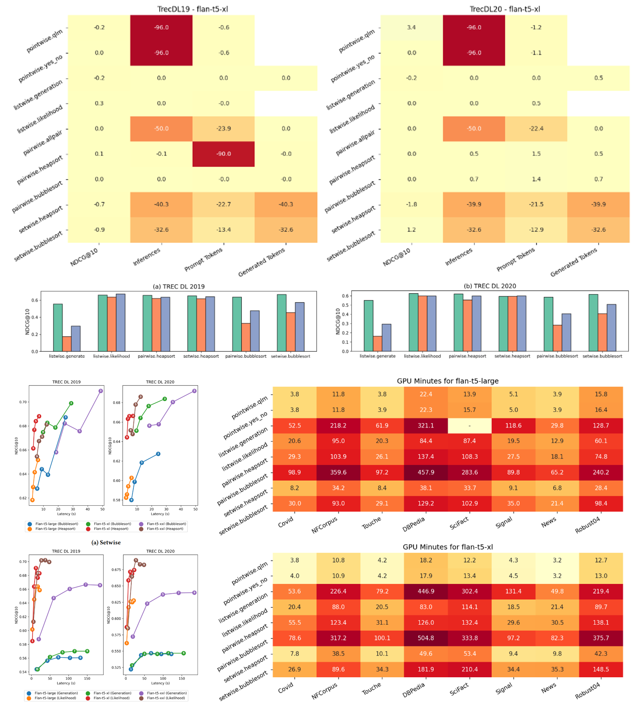
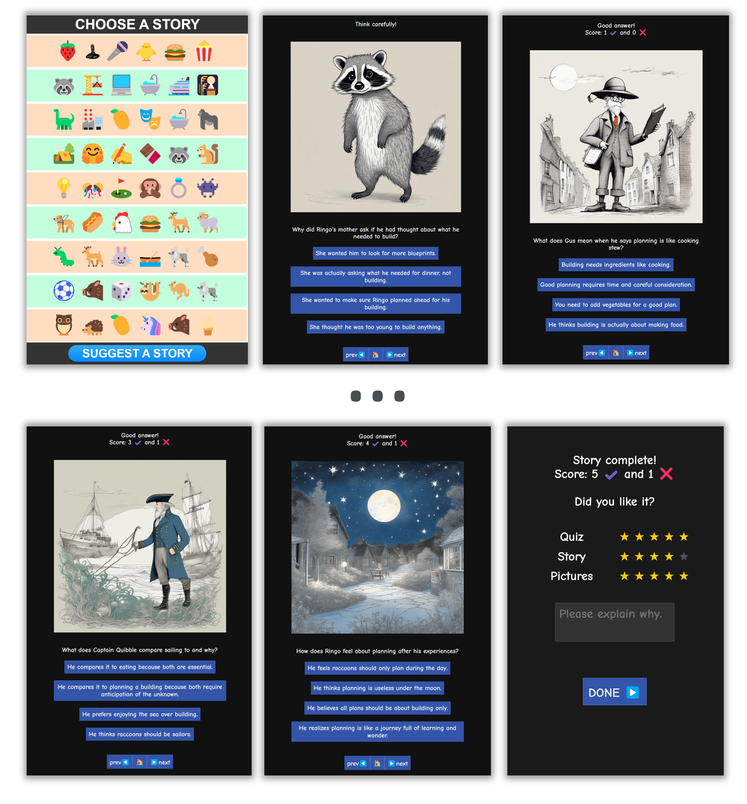
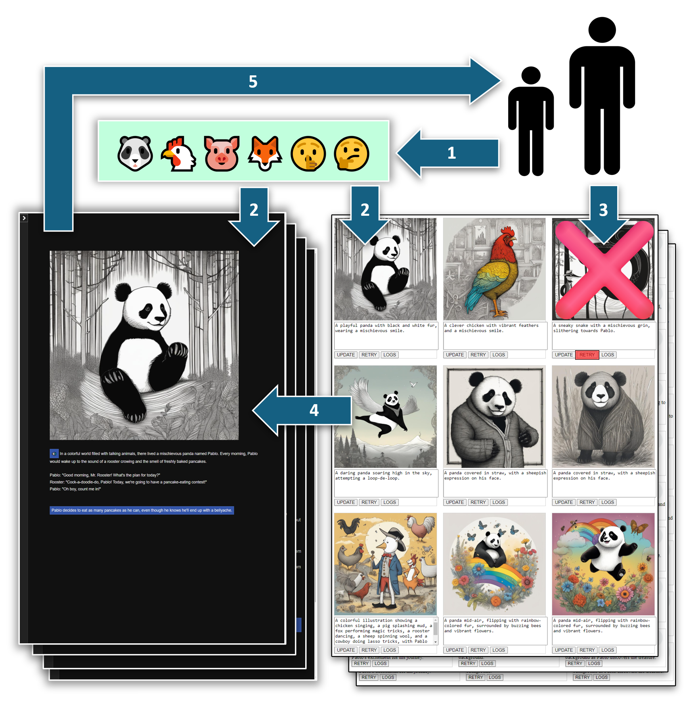
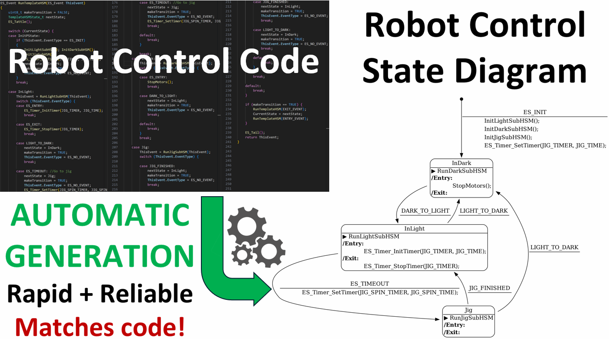



 

<!-- <h1>Projects</h1> -->

<!-- 
 -->

  <h2 id="snipdue">SnipDue: Never Miss Another Deadline</h2>

  

    <!-- 

      
    
 -->
    

      <!-- 
 -->
      Snip pictures of your class schedules, and SnipDue adds all your deadlines to your favorite calendar.
      This project was built
       <!-- in 24hrs -->
      at <a href="https://sb-hacks-xi.devpost.com/" target="_blank">SBHacks XI</a> and with my partner <a href="https://www.linkedin.com/in/samantha-lesner-592aa8211/" target="_blank">Samantha Lesner</a>, we won the "Best Use of GenAI Award" out of 221 participants!
      

        <!-- <a href="https://snipdue.tech/" target="_blank" style="flex: 1; display: inline-block; padding: 0.5rem; text-align: center; background-color: #333; color: white; text-decoration: none; border-radius: 4px; font-size: 0.9rem; white-space: nowrap;">
          <i class="fas fa-external-link-alt" style="margin-right: 0.5rem;"></i>Pitch
        </a>
        <a href="https://snipdue.tech/calendar" target="_blank" style="flex: 1; display: inline-block; padding: 0.5rem; text-align: center; background-color: #333; color: white; text-decoration: none; border-radius: 4px; font-size: 0.9rem; white-space: nowrap;">
          <i class="fas fa-external-link-alt" style="margin-right: 0.5rem;"></i>Try it!
        </a> -->
        <a href="https://devpost.com/software/ssnip" target="_blank" style="flex: 1; display: inline-block; padding: 0.5rem; text-align: center; background-color: #333; color: white; text-decoration: none; border-radius: 4px; font-size: 0.9rem; white-space: nowrap;">
          <i class="fas fa-external-link-alt" style="margin-right: 0.5rem;"></i>DevPost
        </a>
        <a href="https://www.youtube.com/embed/SXRZ5oiWmYE?autoplay=1&fs=1" target="_blank" style="flex: 1; display: inline-block; padding: 0.5rem; text-align: center; background-color: #333; color: white; text-decoration: none; border-radius: 4px; font-size: 0.9rem; white-space: nowrap;">
          <i class="fab fa-youtube" style="margin-right: 0.5rem;"></i>Video
        </a>
        <a href="https://github.com/sklesner/ssnip" target="_blank" style="flex: 1; display: inline-block; padding: 0.5rem; text-align: center; background-color: #333; color: white; text-decoration: none; border-radius: 4px; font-size: 0.9rem; white-space: nowrap;">
          <i class="fas fa-external-link-alt" style="margin-right: 0.5rem;"></i>GitHub
        </a>
        <a href="https://snipdue.tech/" target="_blank" style="flex: 1; display: inline-block; padding: 0.5rem; text-align: center; background-color: #333; color: white; text-decoration: none; border-radius: 4px; font-size: 0.9rem; white-space: nowrap;">
          <i class="fas fa-external-link-alt" style="margin-right: 0.5rem;"></i>Try it!
        </a>
      

      
SnipDue is live 24/7!

    

    

      
      <!--  -->
    

  

  
 

  <h2>Understanding XAI Requirements: A Comparative Study of Repetitive and Unique Decision Contexts</h2>
  

    <!-- 

      
    
 -->
    

      
      <!--  -->
    

    

      
Two Explainable AI (XAI) prototypes were designed and tested with four groups of subjects.
       My partner <a href="https://ml.ucsb.edu/people/faculty/misha-sra">Kay Krachenfels</a>, designed the "Commerce Moderator" and I designed the "Communication Monitor".      
      

      

        <!-- <a href="https://xai.ackop.com/xai_169.pdf" target="_blank" style="flex: 1; display: inline-block; padding: 0.5rem; text-align: center; background-color: #333; color: white; text-decoration: none; border-radius: 4px; font-size: 0.9rem; white-space: nowrap;">
          <i class="fas fa-file-powerpoint" style="margin-right: 0.5rem;"></i>Slides
        </a> -->
        <a href="https://xai.ackop.com/xai_0021.pdf" target="_blank" style="flex: 1; display: inline-block; padding: 0.5rem; text-align: center; background-color: #333; color: white; text-decoration: none; border-radius: 4px; font-size: 0.9rem; white-space: nowrap;">
          <i class="fas fa-file-alt" style="margin-right: 0.5rem;"></i>Pilot Study Report
        </a>
        <a href="https://memoir.ackop.com/index7.html" target="_blank" style="flex: 1; display: inline-block; padding: 0.5rem; text-align: center; background-color: #333; color: white; text-decoration: none; border-radius: 4px; font-size: 0.9rem; white-space: nowrap;">
          <i class="fas fa-external-link-alt" style="margin-right: 0.5rem;"></i>Monitor Pitch
        </a>
        <a href="https://xai.ackop.com/monitor.html" target="_blank" style="flex: 1; display: inline-block; padding: 0.5rem; text-align: center; background-color: #333; color: white; text-decoration: none; border-radius: 4px; font-size: 0.9rem; white-space: nowrap;">
          <i class="fas fa-external-link-alt" style="margin-right: 0.5rem;"></i>Monitor v0.02d
        </a>
        <a href="https://memoir.ackop.com/mapp/split_0014/index.html" target="_blank" style="flex: 1; display: inline-block; padding: 0.5rem; text-align: center; background-color: #333; color: white; text-decoration: none; border-radius: 4px; font-size: 0.9rem; white-space: nowrap;">
          <i class="fas fa-external-link-alt" style="margin-right: 0.5rem;"></i>Monitor v0.01w
        </a>
        <!-- <a href="https://xai.ackop.com/moderator.html" target="_blank" style="flex: 1; display: inline-block; padding: 0.5rem; text-align: center; background-color: #333; color: white; text-decoration: none; border-radius: 4px; font-size: 0.9rem; white-space: nowrap;">
          <i class="fas fa-external-link-alt" style="margin-right: 0.5rem;"></i>Moderator v0.01d
        </a> -->
      

      
<a href="../publication/2024-12-xai_preprint">Pilot study</a> has been completed. Mentored by <a href="https://ml.ucsb.edu/people/faculty/misha-sra" target="_blank">Dr. Misha Sra</a> we are recuriting for a full study to publish.

    

  

  
 
  <h2>Zero-Shot Document Ranking Using LLMs: Replication and Improvements</h2>

  

    <!-- 

      
    
 -->
    

      

      My partner <a href="https://mehak126.github.io/" >Mehak Dhaliwal</a> and I conducted a replication and enhacement study of recent advances in zero-shot document ranking with Large Language Models (LLMs).
      <!-- , focusing on the Setwise approach introduced at SIGIR 2024. -->
      

      

        <!-- <a href="https://xai.ackop.com/xai_169.pdf" target="_blank" style="flex: 1; display: inline-block; padding: 0.5rem; text-align: center; background-color: #333; color: white; text-decoration: none; border-radius: 4px; font-size: 0.9rem; white-space: nowrap;">
          <i class="fas fa-file-powerpoint" style="margin-right: 0.5rem;"></i>Slides
        </a> -->
        <a href="https://repllmr.ackop.com/repllmr_0022.pdf" target="_blank" style="flex: 1; display: inline-block; padding: 0.5rem; text-align: center; background-color: #333; color: white; text-decoration: none; border-radius: 4px; font-size: 0.9rem; white-space: nowrap;">
          <i class="fas fa-file-alt" style="margin-right: 0.5rem;"></i>Pilot Study Report
        </a>
        <a href="https://github.com/mehak126/llm-rankers" target="_blank" style="flex: 1; display: inline-block; padding: 0.5rem; text-align: center; background-color: #333; color: white; text-decoration: none; border-radius: 4px; font-size: 0.9rem; white-space: nowrap;">
          <i class="fab fa-github" style="margin-right: 0.5rem;"></i>GitHub
        </a>        
        <a href="https://repllmr.ackop.com/jbook_a/index.html" target="_blank" style="flex: 1; display: inline-block; padding: 0.5rem; text-align: center; background-color: #333; color: white; text-decoration: none; border-radius: 4px; font-size: 0.9rem; white-space: nowrap;">
          <i class="fas fa-external-link-alt" style="margin-right: 0.5rem;"></i>Pilot Study Analysis
        </a>
        <!-- <a href="https://repllmr.ackop.com/jbook_b/index.html" target="_blank" style="flex: 1; display: inline-block; padding: 0.5rem; text-align: center; background-color: #333; color: white; text-decoration: none; border-radius: 4px; font-size: 0.9rem; white-space: nowrap;">
          <i class="fas fa-external-link-alt" style="margin-right: 0.5rem;"></i>Pilot Analysis B
        </a> -->
      

      
<a href="../publication/2025-01-repllmr_preprint" >Pilot study</a> has been completed. Next steps to publication are scheduled with <a href="https://www.cs.ucsb.edu/people/faculty/tao-yang">Dr. Tao Yang</a> as our mentor for June 2025.

    

    

      
      <!--  -->
    

  

  
 

  <h2>Embedding Augmentation of USDA’s Food Nutrient Imputation</h2>
  

    

      
    

    

      <!-- 
 -->
      UCSB gradute course <a href="https://catalog.ucsb.edu/courses/PSTAT%20231">PSTAT 231</a> 
      asked me to pick a real world data set and investigate an interesting research question.
      For medical reasons, I was curious about the nutritional content of various foods and
      whether LLM technology from OpenAI can help estimte this better. 
      

        <a href="https://fnana3.ackop.com/fnana0043g.html" target="_blank" style="flex: 1; display: inline-block; padding: 0.5rem; text-align: center; background-color: #333; color: white; text-decoration: none; border-radius: 4px; font-size: 0.9rem; white-space: nowrap;">
          <i class="fas fa-external-link-alt" style="margin-right: 0.5rem;"></i>Pilot Study Analysis
        </a>
      

      
<a href="https://fnana3.ackop.com/fnana0043g.html" target="_blank">Pilot Study</a> is complete. Seeking a mentor to take this research further.

      <!-- 

        <a href="https://fnana3.ackop.com/fnana0043g.html" target="_blank" style="flex: 1; display: inline-block; padding: 0.5rem; text-align: center; background-color: #333; color: white; text-decoration: none; border-radius: 4px; font-size: 0.9rem; white-space: nowrap;">
          <i class="fas fa-external-link-alt" style="margin-right: 0.5rem;"></i>Pilot Slides
        </a>
      
 -->
    

  

  
 

  <h2>AI Personalized <emph>Teaching</emph> Fiction (AIPTF)</h2>
  

    

      

        AIPTF preserves the UI from AIPIF but is implemented using Cloudflare functions.
        <!--  -->
        It generates personalized stories that aim to teach children specific life lessons. 
        To get children thinking and challange them, each AIPTF story ends
        with a quiz which tracks correct and wrong answers. 
        <!-- TIP: AI images are revealed by clicking emoji. -->        
      

      

        <!-- <a href="https://youtu.be/TaVGem3nFrk" target="_blank" style="flex: 1; display: inline-block; padding: 0.5rem; text-align: center; background-color: #333; color: white; text-decoration: none; border-radius: 4px; font-size: 0.9rem; white-space: nowrap;">
          <i class="fab fa-youtube" style="margin-right: 0.5rem;"></i>See it!
        </a> -->
        <a href="https://www.ufafu.com/" target="_blank" style="flex: 1; display: inline-block; padding: 0.5rem; text-align: center; background-color: #333; color: white; text-decoration: none; border-radius: 4px; font-size: 0.9rem; white-space: nowrap;">
          <i class="fas fa-external-link-alt" style="margin-right: 0.5rem;"></i>Try it!
        </a>        
        

        TIP: Emoji clicks reveal images. 
        Teaching stories with quizes and illustratons are live 24x7. 
        <!-- Story narration and music are AIPIF stubs.  -->
        

      

    

    

      
    

  

  
 

  <h2>AI Personalized Interactive Fiction (AIPIF)</h2>
  

    

      
    

    

      <!-- 
 -->
      This project started with three partners during the 
      <a href="https://courses.engineering.ucsc.edu/courses/cmpm146">CMPM146: Game AI</a> course
      offered by <a href="http://www.isle.org/~dgs/">Dr. Daniel Shapiro</a>.
      <!--  -->
      <!-- Our idea was to demonstrate AI generation of stories for young children. 
      While my partners tackled AI illustrations, AI sound effects and AI music,
      my part was to implement AI stories with choices and branched narration. 
      I also created our WebApp that lets young children create and enjoy these stories.       
      My tools were Python/Flask/Bash/XSLT/HTML and AI API's from OpenAI and Anthropic.  -->
      <!-- Deployment uses AWS EC2 and AWS S3.  -->
      Afterwards with the mentorship of Dr. Shaprio 
      our work was demonstrated at <a href="https://www.ecai2024.eu/calls/demos">ECAI 2024</a> and 
      published as part of <a href="https://www.ecai2024.eu/calls/pais">PAIS 2024</a>.
      

        <a href="https://youtu.be/TaVGem3nFrk" target="_blank" style="flex: 1; display: inline-block; padding: 0.5rem; text-align: center; background-color: #333; color: white; text-decoration: none; border-radius: 4px; font-size: 0.9rem; white-space: nowrap;">
          <i class="fab fa-youtube" style="margin-right: 0.5rem;"></i>Video
        </a>
        <a href="https://www.ufafu.com/" target="_blank" style="flex: 1; display: inline-block; padding: 0.5rem; text-align: center; background-color: #333; color: white; text-decoration: none; border-radius: 4px; font-size: 0.9rem; white-space: nowrap;">
          <i class="fas fa-external-link-alt" style="margin-right: 0.5rem;"></i>Try it!
        </a>
        <a href="https://github.com/jlesner/aipif/blob/main/doc/aipif_ecai2024_poster_0016.pdf" target="_blank" style="flex: 1; display: inline-block; padding: 0.5rem; text-align: center; background-color: #333; color: white; text-decoration: none; border-radius: 4px; font-size: 0.9rem; white-space: nowrap;">
          <i class="fas fa-external-link-alt" style="margin-right: 0.5rem;"></i>Poster
        </a>
        <a href="https://ebooks.iospress.nl/doi/10.3233/FAIA241036" target="_blank" style="flex: 1; display: inline-block; padding: 0.5rem; text-align: center; background-color: #333; color: white; text-decoration: none; border-radius: 4px; font-size: 0.9rem; white-space: nowrap;">
          <i class="fas fa-external-link-alt" style="margin-right: 0.5rem;"></i>ECAI
        </a>
        <a href="https://ebooks.iospress.nl/doi/10.3233/FAIA241074" target="_blank" style="flex: 1; display: inline-block; padding: 0.5rem; text-align: center; background-color: #333; color: white; text-decoration: none; border-radius: 4px; font-size: 0.9rem; white-space: nowrap;">
          <i class="fas fa-external-link-alt" style="margin-right: 0.5rem;"></i>PAIS
        </a>
        <a href="https://github.com/jlesner/aipif" target="_blank" style="flex: 1; display: inline-block; padding: 0.5rem; text-align: center; background-color: #333; color: white; text-decoration: none; border-radius: 4px; font-size: 0.9rem; white-space: nowrap;">
          <i class="fab fa-github" style="margin-right: 0.5rem;"></i>GitHub
        </a>
      

      
Try it! New stories are disabled for cost reasons. All else is live 24x7.

    

  

  
 

  <h2 id="smv">State Machine Visualizer (SMV)</h2>
  

    

      The idea came from 
      <a href="https://users.soe.ucsc.edu/~elkaim/elkaim/Home.html">Dr.Gabe Elkaim</a> 
      <!-- for his
      <a href="https://courses.engineering.ucsc.edu/courses/ece118">ECE118: Introduction to Mechatronics</a>
      course  -->
      as a research project for my 
      <!-- CAHSI Local Research Experiences for Undergraduates (LREU) Program which is a  -->
      CAHSI/NSF sponsored undergradute research internship. 
      Dr.Elkaim guided the requirements while I carried out development and testing.
      <!--  -->
      

        <a href="https://www.youtube.com/watch?v=IHp0X0J5Di8?autoplay=1&fs=1" target="_blank" style="flex: 1; display: inline-block; padding: 0.5rem; text-align: center; background-color: #333; color: white; text-decoration: none; border-radius: 4px; font-size: 0.9rem; white-space: nowrap;">
          <i class="fab fa-youtube" style="margin-right: 0.5rem;"></i>Video
        </a>
        <a href="https://github.com/jlesner/smv2/blob/main/doc/48x36_smv_poster_010.pdf" target="_blank" style="flex: 1; display: inline-block; padding: 0.5rem; text-align: center; background-color: #333; color: white; text-decoration: none; border-radius: 4px; font-size: 0.9rem; white-space: nowrap;">
          <i class="fas fa-external-link-alt" style="margin-right: 0.5rem;"></i>Poster
        </a>
        <a href="https://github.com/jlesner/smv2" target="_blank" style="flex: 1; display: inline-block; padding: 0.5rem; text-align: center; background-color: #333; color: white; text-decoration: none; border-radius: 4px; font-size: 0.9rem; white-space: nowrap;">
          <i class="fab fa-github" style="margin-right: 0.5rem;"></i>GitHub
        </a>
        <!-- <a href="https://github.com/jlesner/smv2" target="_blank" style="flex: 1; display: inline-block; padding: 0.5rem; text-align: center; background-color: #333; color: white; text-decoration: none; border-radius: 4px; font-size: 0.9rem; white-space: nowrap;">
          <i class="fab fa-github" style="margin-right: 0.5rem;"></i>Tech Report PDF
        </a> -->
        <a href="https://smv.ackop.com/smv_ieee_ICRA_0051.pdf" target="_blank" style="flex: 1; display: inline-block; padding: 0.5rem; text-align: center; background-color: #333; color: white; text-decoration: none; border-radius: 4px; font-size: 0.9rem; white-space: nowrap;">
          <i class="fas fa-file-alt" style="margin-right: 0.5rem;"></i>ICRA Submisson
        </a>
      

      
Our <a href="https://smv.ackop.com/smv_ieee_ICRA_0051.pdf">ICRA submisson</a> is pending peer review.

      <!-- See <a href="https://youtu.be/IHp0X0J5Di8">video</a> or <a href="https://github.com/jlesner/smv2/blob/main/doc/48x36_smv_poster_010.pdf">poster</a>.  -->
    

    

      
    

  

  
<!-- 
 -->

<!-- Add Font Awesome for icons -->
<link rel="stylesheet" href="https://cdnjs.cloudflare.com/ajax/libs/font-awesome/5.15.4/css/all.min.css">
