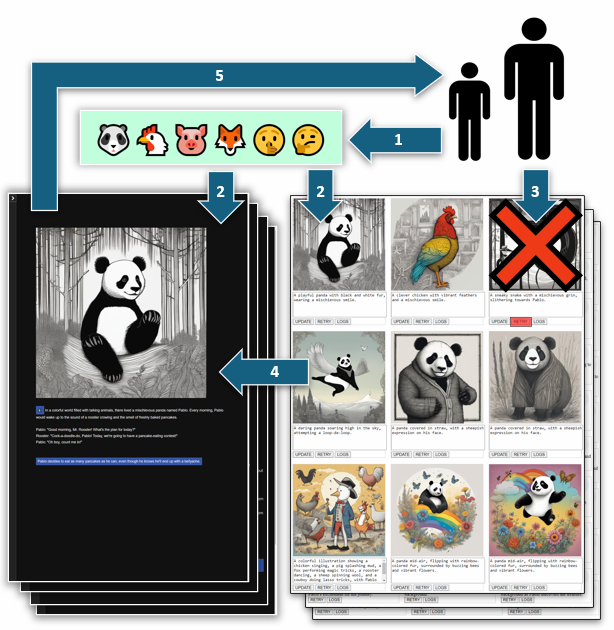



 

<!-- <h1>Projects</h1> -->

<!-- 
 -->

  

    <!-- 

      
    
 -->
    

      <h2>SnipDue: Never Miss Another Deadline</h2>
      

      Snip pictures of your class schedules, and SnipDue adds all your deadlines to your favorite calendar. It's that easy.
      This project was started at <a href="https://sb-hacks-xi.devpost.com/">SBHack XI</a>.
      My team with <a href="#">Samantha Lesner</a>, won the "Best Use of GenAI Award" out of 221 participants!
      

      

        <!-- <a href="https://snipdue.tech/" target="_blank" style="flex: 1; display: inline-block; padding: 0.5rem; text-align: center; background-color: #333; color: white; text-decoration: none; border-radius: 4px; font-size: 0.9rem; white-space: nowrap;">
          <i class="fas fa-external-link-alt" style="margin-right: 0.5rem;"></i>Pitch
        </a>
        <a href="https://snipdue.tech/calendar" target="_blank" style="flex: 1; display: inline-block; padding: 0.5rem; text-align: center; background-color: #333; color: white; text-decoration: none; border-radius: 4px; font-size: 0.9rem; white-space: nowrap;">
          <i class="fas fa-external-link-alt" style="margin-right: 0.5rem;"></i>Try it!
        </a> -->
        <a href="https://devpost.com/software/ssnip" target="_blank" style="flex: 1; display: inline-block; padding: 0.5rem; text-align: center; background-color: #333; color: white; text-decoration: none; border-radius: 4px; font-size: 0.9rem; white-space: nowrap;">
          <i class="fas fa-file-alt" style="margin-right: 0.5rem;"></i>DevPost
        </a>
        <a href="https://www.youtube.com/embed/SXRZ5oiWmYE?autoplay=1&fs=1" target="_blank" style="flex: 1; display: inline-block; padding: 0.5rem; text-align: center; background-color: #333; color: white; text-decoration: none; border-radius: 4px; font-size: 0.9rem; white-space: nowrap;">
          <i class="fab fa-youtube" style="margin-right: 0.5rem;"></i>Video
        </a>
        <a href="https://github.com/sklesner/ssnip" target="_blank" style="flex: 1; display: inline-block; padding: 0.5rem; text-align: center; background-color: #333; color: white; text-decoration: none; border-radius: 4px; font-size: 0.9rem; white-space: nowrap;">
          <i class="fas fa-file-alt" style="margin-right: 0.5rem;"></i>GitHub
        </a>
        <a href="https://snipdue.tech/" target="_blank" style="flex: 1; display: inline-block; padding: 0.5rem; text-align: center; background-color: #333; color: white; text-decoration: none; border-radius: 4px; font-size: 0.9rem; white-space: nowrap;">
          <i class="fas fa-external-link-alt" style="margin-right: 0.5rem;"></i>Try it!
        </a>
      

    

    

      
      <!--  -->
    

  

  
 

  

    <!-- 

      
    
 -->
    

      
      <!--  -->
    

    

      <h2>Understanding XAI Requirements: A Comparative Study of Repetitive and Unique Decision Contexts</h2>
      
Two Explainable AI (XAI) prototypes were designed and tested with four groups of subjects.
       My partner <a href="https://ml.ucsb.edu/people/faculty/misha-sra">Kay Krachenfels</a>, designed the "Commerce Moderator" and I designed the "Communication Monitor". 
      

      

      Mentor: <a href="https://ml.ucsb.edu/people/faculty/misha-sra">Dr. Misha Sra</a>
      

      

      STATUS: Pilot study complete. Now recuriting for a full study to publish.
      

      

        <a href="https://xai.ackop.com/xai_169.pdf" target="_blank" style="flex: 1; display: inline-block; padding: 0.5rem; text-align: center; background-color: #333; color: white; text-decoration: none; border-radius: 4px; font-size: 0.9rem; white-space: nowrap;">
          <i class="fas fa-file-powerpoint" style="margin-right: 0.5rem;"></i>Slides
        </a>
        <a href="https://xai.ackop.com/xai_0021.pdf" target="_blank" style="flex: 1; display: inline-block; padding: 0.5rem; text-align: center; background-color: #333; color: white; text-decoration: none; border-radius: 4px; font-size: 0.9rem; white-space: nowrap;">
          <i class="fas fa-file-alt" style="margin-right: 0.5rem;"></i>Pilot Report
        </a>
        <a href="https://memoir.ackop.com/index7.html" target="_blank" style="flex: 1; display: inline-block; padding: 0.5rem; text-align: center; background-color: #333; color: white; text-decoration: none; border-radius: 4px; font-size: 0.9rem; white-space: nowrap;">
          <i class="fas fa-external-link-alt" style="margin-right: 0.5rem;"></i>Monitor Pitch
        </a>
        <a href="https://xai.ackop.com/monitor.html" target="_blank" style="flex: 1; display: inline-block; padding: 0.5rem; text-align: center; background-color: #333; color: white; text-decoration: none; border-radius: 4px; font-size: 0.9rem; white-space: nowrap;">
          <i class="fas fa-external-link-alt" style="margin-right: 0.5rem;"></i>Monitor v0.02d
        </a>
        <a href="https://memoir.ackop.com/mapp/split_0014/index.html" target="_blank" style="flex: 1; display: inline-block; padding: 0.5rem; text-align: center; background-color: #333; color: white; text-decoration: none; border-radius: 4px; font-size: 0.9rem; white-space: nowrap;">
          <i class="fas fa-external-link-alt" style="margin-right: 0.5rem;"></i>Monitor v0.02w
        </a>
        <a href="https://xai.ackop.com/moderator.html" target="_blank" style="flex: 1; display: inline-block; padding: 0.5rem; text-align: center; background-color: #333; color: white; text-decoration: none; border-radius: 4px; font-size: 0.9rem; white-space: nowrap;">
          <i class="fas fa-external-link-alt" style="margin-right: 0.5rem;"></i>Moderator v0.01d
        </a>
      

    

  

  
 

  

    <!-- 

      
    
 -->
    

      
      <!--  -->
    

    

      <h2>Zero-Shot Document Ranking Using LLMs: Replication and Improvements</h2>
      

      Mehak  and I conducted a replication study of recent advances in zero-shot document ranking with Large Language Models (LLMs), focusing on the Setwise approach introduced at SIGIR 2024. 
      Our results confirm high fidelity in effectiveness metrics (NDCG@10 within ±3%) but reveal efficiency discrepancies, including 33–40% lower token usage for setwise methods. Expanding on the original work, we evaluated performance on the NovelEval-2306 dataset, showing strong ranking capabilities for queries beyond the models’ training cutoff. Systematic prompt engineering yields up to 40.7% improvements in NDCG@10 for specific method-dataset pairs, with setwise methods benefiting the most. Experiments with instruction-tuned and conversationally fine-tuned models (Llama 3.1, Llama 2) show consistent gains without added computational cost. These findings validate the original conclusions and highlight strategies for optimizing LLM-based ranking systems through prompt engineering and model selection. 
      

      

      Mentor: <a href="https://www.cs.ucsb.edu/people/faculty/tao-yang">Dr. Tao Yang</a>
      

      

      STATUS: <a href="https://xai.ackop.com/xai_0021.pdf">Pilot study completed.</a> Work towards publication scheduled for June 2025.
      

      

        <!-- <a href="https://xai.ackop.com/xai_169.pdf" target="_blank" style="flex: 1; display: inline-block; padding: 0.5rem; text-align: center; background-color: #333; color: white; text-decoration: none; border-radius: 4px; font-size: 0.9rem; white-space: nowrap;">
          <i class="fas fa-file-powerpoint" style="margin-right: 0.5rem;"></i>Slides
        </a> -->
        <a href="https://xai.ackop.com/xai_0021.pdf" target="_blank" style="flex: 1; display: inline-block; padding: 0.5rem; text-align: center; background-color: #333; color: white; text-decoration: none; border-radius: 4px; font-size: 0.9rem; white-space: nowrap;">
          <i class="fas fa-file-alt" style="margin-right: 0.5rem;"></i>Pilot Report
        </a>
        <a href="https://memoir.ackop.com/index7.html" target="_blank" style="flex: 1; display: inline-block; padding: 0.5rem; text-align: center; background-color: #333; color: white; text-decoration: none; border-radius: 4px; font-size: 0.9rem; white-space: nowrap;">
          <i class="fas fa-external-link-alt" style="margin-right: 0.5rem;"></i>Pilot Analysis 1
        </a>
        <a href="https://memoir.ackop.com/index7.html" target="_blank" style="flex: 1; display: inline-block; padding: 0.5rem; text-align: center; background-color: #333; color: white; text-decoration: none; border-radius: 4px; font-size: 0.9rem; white-space: nowrap;">
          <i class="fas fa-external-link-alt" style="margin-right: 0.5rem;"></i>Pilot Analysis 2
        </a>
        <a href="https://xai.ackop.com/monitor.html" target="_blank" style="flex: 1; display: inline-block; padding: 0.5rem; text-align: center; background-color: #333; color: white; text-decoration: none; border-radius: 4px; font-size: 0.9rem; white-space: nowrap;">
          <i class="fas fa-external-link-alt" style="margin-right: 0.5rem;"></i>GitHub
        </a>        
      

    

  

  
 

  

    

      <h2>Embedding Augmentation of USDA’s Food Nutrient Imputation</h2>
      

      UCSB gradute course <a href="https://catalog.ucsb.edu/courses/PSTAT%20231">PSTAT 231</a> 
      asked us to pick a real world data set and investigate an interesting research question.
      

      Being curious about the nutritional content of our food and whether LLM can help with this:
      <emph>How well can <a href="#">OpenAI's embeddings</a> augment <a href="#">USDA's National Food Nutrient Database</emph>
      

      

      For personal medical reasons my pilot study of this question is focused on estimation of Iron content in foods.
      <!-- (1) Embeddings can cluster foods more precisely than existing food groups.
      (2) Embeddings and their clusters can predict the nutritional content of foods.
      (3) Imputation powered by embedding vectors may be better than traditional imputation. -->
      

      
STATUS: Pilot Study Complete. <emph>Contact me if interested to take it further.</emph>

      

        <a href="https://fnana3.ackop.com/fnana0043g.html" target="_blank" style="flex: 1; display: inline-block; padding: 0.5rem; text-align: center; background-color: #333; color: white; text-decoration: none; border-radius: 4px; font-size: 0.9rem; white-space: nowrap;">
          <i class="fas fa-external-link-alt" style="margin-right: 0.5rem;"></i>Pilot Report
        </a>
      

      <!-- 

        <a href="https://fnana3.ackop.com/fnana0043g.html" target="_blank" style="flex: 1; display: inline-block; padding: 0.5rem; text-align: center; background-color: #333; color: white; text-decoration: none; border-radius: 4px; font-size: 0.9rem; white-space: nowrap;">
          <i class="fas fa-external-link-alt" style="margin-right: 0.5rem;"></i>Pilot Slides
        </a>
      
 -->
    

    

      
    

  

  
 

  

    

      
    

    

      <h2>AI Personalized <emph>Teaching</emph> Fiction (AIPTF)</h2>
      

        After AIPIF (see below) I became interested in AIPTF which is my term 
        for AI personalized stories to teach children specific lessons. 
      

      <!-- 
 
        AIPTF is a solo hobby project to also learn scalable software 
        design using serverless functions.
      
 -->
      

        AIPTF preserves the UI from AIPIF but all else is rewritten using Cloudflare functions.
        For example AIPIF uses a compiled binary tool to create
        twine files but because Cloudflare has no way to run that 
        I reimplemented Twine creation in javascript.
      

  
        To get children thinking and challange them, each AIPTF story ends
        with a quiz which tracks correct and wrong answers. 
      

        STATUS: Stories with quizes and illustratons are live 24x7.
      

  
        TIP: AI images are revealed by clicking emoji.
      

      

        <!-- <a href="https://youtu.be/TaVGem3nFrk" target="_blank" style="flex: 1; display: inline-block; padding: 0.5rem; text-align: center; background-color: #333; color: white; text-decoration: none; border-radius: 4px; font-size: 0.9rem; white-space: nowrap;">
          <i class="fab fa-youtube" style="margin-right: 0.5rem;"></i>See it!
        </a> -->
        <a href="https://www.ufafu.com/" target="_blank" style="flex: 1; display: inline-block; padding: 0.5rem; text-align: center; background-color: #333; color: white; text-decoration: none; border-radius: 4px; font-size: 0.9rem; white-space: nowrap;">
          <i class="fas fa-external-link-alt" style="margin-right: 0.5rem;"></i>Try it!
        </a>
      

    

  

  
 

  

    

      
    

    

      <h2>AI Personalized Interactive Fiction (AIPIF)</h2>
      

      This project started with three partners during the 
      <a href="https://courses.engineering.ucsc.edu/courses/cmpm146">CMPM146: Game AI<a> course
      offered by <a href="http://www.isle.org/~dgs/">Dr. Daniel Shapiro</a>.
      

      Our idea was to demonstrate AI generation of stories for young children. 
      While my partners tackled AI illustrations, AI sound effects and AI music,
      my part was to implement AI stories with choices and branched narration. 
      I also created our WebApp that lets young children create and enjoy these stories.       
      My tools were Python/Flask/Bash/XSLT/HTML and AI API's from OpenAI and Anthropic. 
      <!-- Deployment uses AWS EC2 and AWS S3.  -->
      

      After CMPM146, with the help of my team and mentorship of Dr.Shaprio 
      our work was demonstrated at <a href="#">ECAI 2024 (demo track)</a> and 
      published as part of <a href="#">PAIS 2024 (applicaton track)</a>.
      

      

      STATUS: New stories are disabled. All else is live 24x7.
      <!--  -->
      

      <!-- <ul>
        <li>Large Language Models for dynamic narrative generation</li>
        <li>Text-to-Image (StableDiffusion XL) for visual storytelling</li>
        <li>Text-to-Speech (Bark) and Music Generation (MusicGen) for immersive audio</li>
      </ul> -->
      

        <a href="https://youtu.be/TaVGem3nFrk" target="_blank" style="flex: 1; display: inline-block; padding: 0.5rem; text-align: center; background-color: #333; color: white; text-decoration: none; border-radius: 4px; font-size: 0.9rem; white-space: nowrap;">
          <i class="fab fa-youtube" style="margin-right: 0.5rem;"></i>Video
        </a>
        <a href="https://www.ufafu.com/" target="_blank" style="flex: 1; display: inline-block; padding: 0.5rem; text-align: center; background-color: #333; color: white; text-decoration: none; border-radius: 4px; font-size: 0.9rem; white-space: nowrap;">
          <i class="fas fa-external-link-alt" style="margin-right: 0.5rem;"></i>Try it!
        </a>
        <a href="https://www.ufafu.com/" target="_blank" style="flex: 1; display: inline-block; padding: 0.5rem; text-align: center; background-color: #333; color: white; text-decoration: none; border-radius: 4px; font-size: 0.9rem; white-space: nowrap;">
          <i class="fas fa-external-link-alt" style="margin-right: 0.5rem;"></i>ECAI 2024
        </a>
        <a href="https://www.ufafu.com/" target="_blank" style="flex: 1; display: inline-block; padding: 0.5rem; text-align: center; background-color: #333; color: white; text-decoration: none; border-radius: 4px; font-size: 0.9rem; white-space: nowrap;">
          <i class="fas fa-external-link-alt" style="margin-right: 0.5rem;"></i>PAIS 2024
        </a>
        <a href="https://www.ufafu.com/" target="_blank" style="flex: 1; display: inline-block; padding: 0.5rem; text-align: center; background-color: #333; color: white; text-decoration: none; border-radius: 4px; font-size: 0.9rem; white-space: nowrap;">
          <i class="fas fa-external-link-alt" style="margin-right: 0.5rem;"></i>Poster PDF
        </a>
        <a href="https://github.com/jlesner/aipif" target="_blank" style="flex: 1; display: inline-block; padding: 0.5rem; text-align: center; background-color: #333; color: white; text-decoration: none; border-radius: 4px; font-size: 0.9rem; white-space: nowrap;">
          <i class="fab fa-github" style="margin-right: 0.5rem;"></i>GitHub
        </a>
      

    

  

  
 

  

    

      <h2>State Machine Visualizer (SMV)</h2>
      <!--  -->
      The idea came from 
      <a href="https://users.soe.ucsc.edu/~elkaim/elkaim/Home.html">Dr. Gabe Elkaim</a> 
      for his
      <a href="https://courses.engineering.ucsc.edu/courses/ece118">ECE118: Introduction to Mechatronics<a>
      course and 
      Dr. Elkaim guided the requirements while I carried out development and testing.
      <!--  -->
      <!-- 
The result is a tool to help students better understand complex computational systems by:      
      <ul>
        <li>Automatically generating visual representations of state machines</li>
        <li>Creating an intuitive bridge between code and visual understanding</li>
        <li>Supporting computer science education through improved system visualization</li>
      </ul> -->
      

      STATUS: <a href="#">ICRA submisson</a> pending peer review. See <a href="#">video</a> or <a href="#">poster</a>. 
      

      <!--  -->
      

        <a href="https://www.youtube.com/watch?v=IHp0X0J5Di8?autoplay=1&fs=1" target="_blank" style="flex: 1; display: inline-block; padding: 0.5rem; text-align: center; background-color: #333; color: white; text-decoration: none; border-radius: 4px; font-size: 0.9rem; white-space: nowrap;">
          <i class="fab fa-youtube" style="margin-right: 0.5rem;"></i>Video
        </a>
        <a href="https://www.youtube.com/watch?v=IHp0X0J5Di8?autoplay=1&fs=1" target="_blank" style="flex: 1; display: inline-block; padding: 0.5rem; text-align: center; background-color: #333; color: white; text-decoration: none; border-radius: 4px; font-size: 0.9rem; white-space: nowrap;">
          <i class="fab fa-youtube" style="margin-right: 0.5rem;"></i>Poster
        </a>
        <a href="https://github.com/jlesner/smv2" target="_blank" style="flex: 1; display: inline-block; padding: 0.5rem; text-align: center; background-color: #333; color: white; text-decoration: none; border-radius: 4px; font-size: 0.9rem; white-space: nowrap;">
          <i class="fab fa-github" style="margin-right: 0.5rem;"></i>GitHub
        </a>
        <a href="https://github.com/jlesner/smv2" target="_blank" style="flex: 1; display: inline-block; padding: 0.5rem; text-align: center; background-color: #333; color: white; text-decoration: none; border-radius: 4px; font-size: 0.9rem; white-space: nowrap;">
          <i class="fab fa-github" style="margin-right: 0.5rem;"></i>Tech Report PDF
        </a>
        <a href="https://github.com/jlesner/smv2" target="_blank" style="flex: 1; display: inline-block; padding: 0.5rem; text-align: center; background-color: #333; color: white; text-decoration: none; border-radius: 4px; font-size: 0.9rem; white-space: nowrap;">
          <i class="fab fa-github" style="margin-right: 0.5rem;"></i>ICRA Submisson PDF
        </a>
      

    

    

      
    

  

  
<!-- 
 -->

<!-- Add Font Awesome for icons -->
<link rel="stylesheet" href="https://cdnjs.cloudflare.com/ajax/libs/font-awesome/5.15.4/css/all.min.css">
