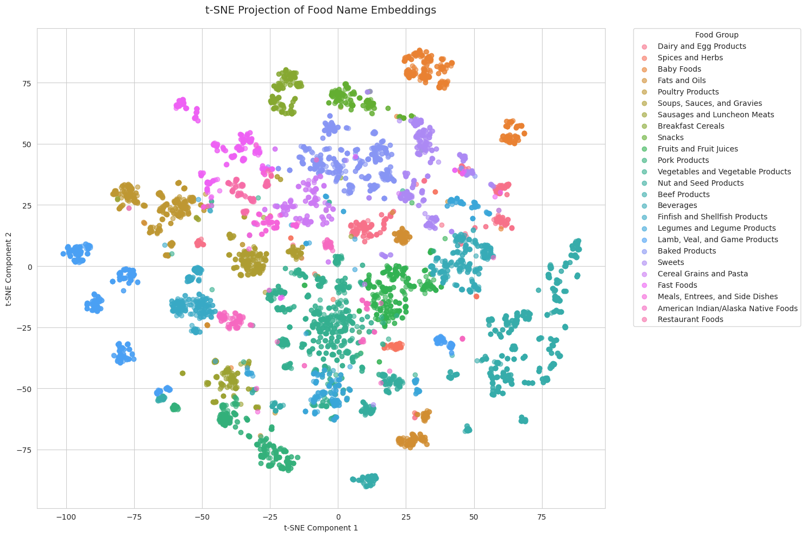



  

  <h1 id="hapo">HAPO: Hyper-reflection for Automatic Prompt Optimization</h1>
  

    

      

        An improvement of GEPA (automatic prompt optimization) through "hyper-reflection", enabling compact LLMs to achieve performance closer to frontier models on complex tasks like SQL query equivalence generation and refutation.
      

      

        <a href="https://jlesner0.ackop.com/hapo_0023.pdf" target="_blank" style="flex: 1; display: inline-block; padding: 0.5rem; text-align: center; background-color: #333; color: white; text-decoration: none; border-radius: 4px; font-size: 0.9rem; white-space: nowrap;">
          <i class="fas fa-file-alt" style="margin-right: 0.5rem;"></i>Preprint
        </a>
      

      

        Preparing submission for IJCAI-2026 with <a href="https://sites.cs.ucsb.edu/~xyan/" target="_blank">Dr. Xifeng Yan</a>.
      

    

    

      
    

  

  

  <h1 id="dbdoctor">DBDoctor: LLM-Aided SMT Refutation of SQL Query Equivalence</h1>
  

    

      
    

    

      

        <!-- A verification framework that combines large language models with SMT solvers to detect semantic bugs in SQL query rewrites. -->
        DBDoctor uses LLMs to propose counterexamples and rewrite queries into SMT-friendly forms, dramatically reducing the rate of "unsupported" query pairs from 100% to 1% and successfully refuting 47% of previously unverifiable cases.
      

      

        <a href="https://jlesner0.ackop.com/dbdoctor_cav_0036.pdf" target="_blank" style="flex: 1; display: inline-block; padding: 0.5rem; text-align: center; background-color: #333; color: white; text-decoration: none; border-radius: 4px; font-size: 0.9rem; white-space: nowrap;">
          <i class="fas fa-file-alt" style="margin-right: 0.5rem;"></i>Preprint
        </a>
      

      

        Preparing submission for CAV-2026 with <a href="https://sites.cs.ucsb.edu/~xyan/" target="_blank">Dr. Xifeng Yan</a>.
      

    

  

  

  <h1 id="symbolsight">SymbolSight: Robust Symbols for Retinal Implants</h1>
  

    

      

        A research project optimizing visual symbol sets for patients with retinal implants. 
        By analyzing confusion matrices over simulated letter recognition using the pulse2percept framework, SymbolSight derives symbol sets that remain distinguishable even under the severe distortions introduced by low-resolution prosthetic vision.
      

      

        <a href="https://jlesner0.ackop.com/symbolsight_0034.pdf" target="_blank" style="flex: 1; display: inline-block; padding: 0.5rem; text-align: center; background-color: #333; color: white; text-decoration: none; border-radius: 4px; font-size: 0.9rem; white-space: nowrap;">
          <i class="fas fa-file-alt" style="margin-right: 0.5rem;"></i>Preprint
        </a>
        <a href="https://youtu.be/S6PFpY1Rfho" target="_blank" style="flex: 1; display: inline-block; padding: 0.5rem; text-align: center; background-color: #333; color: white; text-decoration: none; border-radius: 4px; font-size: 0.9rem; white-space: nowrap;">
          <i class="fab fa-youtube" style="margin-right: 0.5rem;"></i>Video
        </a>
      

      

        Voted #1 out of 16 projects in the graduate Bionic Vision course. Preparing submission for IEEE EMBC-2026 with <a href="https://engineering.ucsb.edu/people/michael-beyeler" target="_blank">Dr. Michael Beyeler</a>.
      

    

    

      
    

  

  

  <h1 id="nutrignn">NutriGNN: Food Nutrient Prediction with GNNs</h1>
  

    

      
    

    

      

        A graph neural network approach to predicting missing nutrient values in food composition databases. 
        By building a knowledge graph enriched with LLM-derived semantic relations between foods, NutriGNN improves representation learning and prediction quality, especially for low-resource food items with sparse nutritional data.
      

      

        <a href="https://jlesner0.ackop.com/nutrignn_0032.pdf" target="_blank" style="flex: 1; display: inline-block; padding: 0.5rem; text-align: center; background-color: #333; color: white; text-decoration: none; border-radius: 4px; font-size: 0.9rem; white-space: nowrap;">
          <i class="fas fa-file-alt" style="margin-right: 0.5rem;"></i>Report
        </a>
      

      

        Developed for a graduate course on Graphs and GNNs with <a href="https://sites.cs.ucsb.edu/~ambuj/" target="_blank">Dr. Ambuj K. Singh</a>.
      

    

  

  

  <h1 id="snipdue">SnipDue: Never Miss Another Deadline</h1>
  

    

      

        A deadline import tool with near universal support for all the ways to represent a schedule. Our tool uses Claude 3.5 Sonnet and works with Google Calendar, Apple Calendar, Outlook, and any iCal-compatible app.
      

      

        <a href="https://devpost.com/software/ssnip" target="_blank" style="flex: 1; display: inline-block; padding: 0.5rem; text-align: center; background-color: #333; color: white; text-decoration: none; border-radius: 4px; font-size: 0.9rem; white-space: nowrap;">
          <i class="fas fa-external-link-alt" style="margin-right: 0.5rem;"></i>DevPost
        </a>
        <a href="https://snipdue.tech/" target="_blank" style="flex: 1; display: inline-block; padding: 0.5rem; text-align: center; background-color: #333; color: white; text-decoration: none; border-radius: 4px; font-size: 0.9rem; white-space: nowrap;">
          <i class="fas fa-external-link-alt" style="margin-right: 0.5rem;"></i>Try it!
        </a>
      

        

        Built at <a href="https://sb-hacks-xi.devpost.com/" target="_blank">SBHacks XI</a> with my partner <a href="https://www.linkedin.com/in/samantha-lesner-592aa8211/" target="_blank">Samantha Lesner</a>, our project won the "Best Use of GenAI Award" out of 221 hackathon participants.
        

    

    

      
      
SnipDue is live and running 24/7!

    

  

  

  <h1>Explainable AI Requirements: A Comparative Study of Repetitive and Unique Decision Contexts</h1>
  

    

      
    

    

      

        We designed and tested two Explainable AI (XAI) prototypes with four groups of participants.
        My partner,
        <a href="https://www.linkedin.com/in/kay-krachenfels/" target="_blank">Kay Krachenfels</a>, created the "Commerce Moderator," while I developed the "Communication Monitor."
      

      

        <a href="https://memoir.ackop.com/index7.html" target="_blank" style="flex: 1; display: inline-block; padding: 0.5rem; text-align: center; background-color: #333; color: white; text-decoration: none; border-radius: 4px; font-size: 0.9rem; white-space: nowrap;">
          <i class="fas fa-external-link-alt" style="margin-right: 0.5rem;"></i>Communication Monitor
        </a>
        <a href="https://xai.ackop.com/xai_0021.pdf" target="_blank" style="flex: 1; display: inline-block; padding: 0.5rem; text-align: center; background-color: #333; color: white; text-decoration: none; border-radius: 4px; font-size: 0.9rem; white-space: nowrap;">
          <i class="fas fa-file-alt" style="margin-right: 0.5rem;"></i>Pilot Study Report
        </a>
      

      <!-- 

      Deciding on a full study for publication with <a href="https://ml.ucsb.edu/people/faculty/misha-sra" target="_blank">Dr. Misha Sra</a>.
      
 -->
    

  

  

  <h1>Zero-Shot Document Ranking Using LLMs: Replication and Improvements</h1>
  

    

      

      My partner, <a href="https://mehak126.github.io/" >Mehak Dhaliwal</a>, and I conducted a study replicating and enhancing recent advancements in zero-shot document ranking using Large Language Models (LLMs).
      

      

        <a href="https://repllmr.ackop.com/repllmr_0022.pdf" target="_blank" style="flex: 1; display: inline-block; padding: 0.5rem; text-align: center; background-color: #333; color: white; text-decoration: none; border-radius: 4px; font-size: 0.9rem; white-space: nowrap;">
          <i class="fas fa-file-alt" style="margin-right: 0.5rem;"></i>Study Report
        </a>
        <a href="https://repllmr.ackop.com/jbook_a/index.html" target="_blank" style="flex: 1; display: inline-block; padding: 0.5rem; text-align: center; background-color: #333; color: white; text-decoration: none; border-radius: 4px; font-size: 0.9rem; white-space: nowrap;">
          <i class="fas fa-external-link-alt" style="margin-right: 0.5rem;"></i>Data Analysis
        </a>
      

      <!-- 

      Plan with <a href="https://www.cs.ucsb.edu/people/faculty/tao-yang">Dr. Tao Yang</a> is to prepare for publication at the end of June 2025.
      
 -->
    

    

      
    

  

  

  <h1>Embedding Vector Augmentation of USDA's Food Nutrient Imputation</h1>
  

    

      
    

    

      

      For a Statistical Machine Learning
      graduate course, I selected <a href="https://fdc.nal.usda.gov/">USDA's food nutrition dataset</a> and chose to explore whether OpenAI's LLM technology can enhance estimates of food nutrition. This research effort was motivated by personal health interests.
      

      

        <a href="https://fnana3.ackop.com/fnana0043g.html" target="_blank" style="flex: 1; display: inline-block; padding: 0.5rem; text-align: center; background-color: #333; color: white; text-decoration: none; border-radius: 4px; font-size: 0.9rem; white-space: nowrap;">
          <i class="fas fa-external-link-alt" style="margin-right: 0.5rem;"></i>Data Analysis Study
        </a>
      

      
Seeking a food nutrition expert to review and help guide this research further.

    

  

  

  <h1 id="aiptf">AI Personalized Teaching Fiction (AIPTF)</h1>
  

    

      

        This solo summer project stemmed from my goal to make AIPIF faster and more cost-efficient. Along the way, I developed stories to teach children specific life lessons. Each story includes a quiz at the end to encourage critical thinking and tracks correct and incorrect answers. While AIPTF keeps the original AIPIF interface, I re-implemented the back-end using Javascript Cloudflare functions.
      

      

        <a href="https://www.ufafu.com/" target="_blank" style="flex: 1; display: inline-block; padding: 0.5rem; text-align: center; background-color: #333; color: white; text-decoration: none; border-radius: 4px; font-size: 0.9rem; white-space: nowrap;">
          <i class="fas fa-external-link-alt" style="margin-right: 0.5rem;"></i>Try it!
        </a>
      

      
AIPTF is live and running 24/7!

    

    

      
      TIP: Click on emojis to reveal images.
    

  

  

  <h1 id="aipif">AI Personalized Interactive Fiction (AIPIF)</h1>
  

    

      
    

    

      

      AIPIF began
      with three partners in <a href="http://www.isle.org/~dgs/">Dr. Daniel Shapiro</a>'s
      <a href="https://courses.engineering.ucsc.edu/courses/cmpm146">CMPM146: Game AI</a>
      course and with his mentorship, we refined the project and showcased it at
      ECAI-2024 and PAIS-2024.
      

      

        <a href="https://youtu.be/TaVGem3nFrk?autoplay=1&fs=1" target="_blank" style="flex: 1; display: inline-block; padding: 0.5rem; text-align: center; background-color: #333; color: white; text-decoration: none; border-radius: 4px; font-size: 0.9rem; white-space: nowrap;">
          <i class="fab fa-youtube" style="margin-right: 0.5rem;"></i>Video
        </a>
        <a href="https://www.ufafu.com/" target="_blank" style="flex: 1; display: inline-block; padding: 0.5rem; text-align: center; background-color: #333; color: white; text-decoration: none; border-radius: 4px; font-size: 0.9rem; white-space: nowrap;">
          <i class="fas fa-external-link-alt" style="margin-right: 0.5rem;"></i>Try it!
        </a>
        <a href="/photos#ecai2024" target="_blank" style="flex: 1; display: inline-block; padding: 0.5rem; text-align: center; background-color: #333; color: white; text-decoration: none; border-radius: 4px; font-size: 0.9rem; white-space: nowrap;">
          <i class="fas fa-external-link-alt" style="margin-right: 0.5rem;"></i>Conferences
        </a>
        <a href="https://ebooks.iospress.nl/doi/10.3233/FAIA241074" target="_blank" style="flex: 1; display: inline-block; padding: 0.5rem; text-align: center; background-color: #333; color: white; text-decoration: none; border-radius: 4px; font-size: 0.9rem; white-space: nowrap;">
          <i class="fas fa-external-link-alt" style="margin-right: 0.5rem;"></i>Publication
        </a>
      

      
New AIPIF stories are disabled to manage costs. All other features are live 24/7.

    

  

  

  <h1 id="smv">State Machine Visualizer (SMV)</h1>
  

    

      This project was advised by <a href="https://users.soe.ucsc.edu/~elkaim/elkaim/Home.html">Dr. Gabriel Elkaim</a>
      and began during my CAHSI/NSF-sponsored undergraduate research internship.
      Dr. Elkaim provided guidance on requirements, while I focused on development and testing.
      

        <a href="https://www.youtube.com/watch?v=IHp0X0J5Di8?autoplay=1&fs=1" target="_blank" style="flex: 1; display: inline-block; padding: 0.5rem; text-align: center; background-color: #333; color: white; text-decoration: none; border-radius: 4px; font-size: 0.9rem; white-space: nowrap;">
          <i class="fab fa-youtube" style="margin-right: 0.5rem;"></i>Video
        </a>
        <a href="https://github.com/jlesner/smv2" target="_blank" style="flex: 1; display: inline-block; padding: 0.5rem; text-align: center; background-color: #333; color: white; text-decoration: none; border-radius: 4px; font-size: 0.9rem; white-space: nowrap;">
          <i class="fab fa-github" style="margin-right: 0.5rem;"></i>GitHub
        </a>
        <a href="https://smv.ackop.com/smv_ieee_ICRA_0054.pdf" target="_blank" style="flex: 1; display: inline-block; padding: 0.5rem; text-align: center; background-color: #333; color: white; text-decoration: none; border-radius: 4px; font-size: 0.9rem; white-space: nowrap;">
          <i class="fas fa-file-alt" style="margin-right: 0.5rem;"></i>Preprint
        </a>
      

      <!-- 

        Preprint pending ICRA-2025 peer review.
      
 -->
    

    

      
    

  

  

<link rel="stylesheet" href="https://cdnjs.cloudflare.com/ajax/libs/font-awesome/5.15.4/css/all.min.css">
